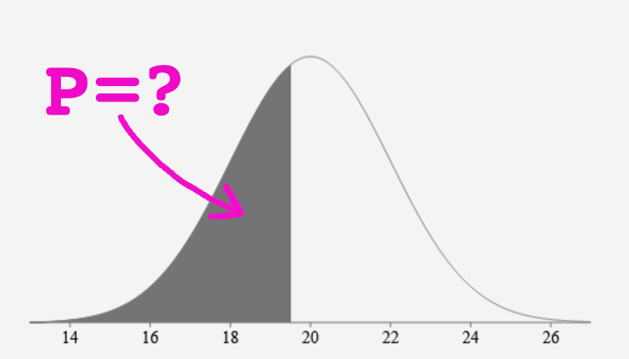
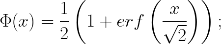
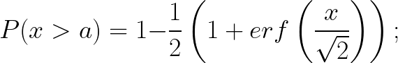
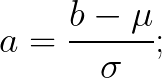
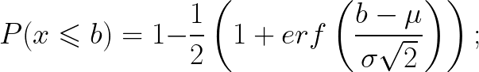
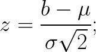
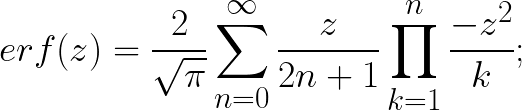
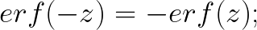

# Normal distribution probability

## Objective

Having a normal distribution with a mean (μ) and a standard deviation (σ). 

What is the probability that a random value will be less than some specific bound?

The probability that the random value is less than the bound is the complement of the standard normal cumulative distribution function (CDF).

## The standard normal cumulative distribution function

## Probability that a random value (x) is less than bound (a) at standard normal distribution

## Probability at normal distribution with mean and standard deviation

μ - mean;
σ - standard deviation;

## Error function

## Expansion of the integral using the Taylor series

## Test data

## Error function

| z     | erf(z)      |
| ----- | ----------- |
| 0     | 0           |
| 0.02 	| 0.022564575 |
| 0.04 	| 0.045111106 |
| 0.06 	| 0.067621594 |
| 0.08 	| 0.090078126 |
| 0.1 	| 0.112462916 |
| 0.2 	| 0.222702589 |
| 0.3 	| 0.328626759 |
| 0.4 	| 0.428392355 |
| 0.5 	| 0.520499878 |
| 0.6 	| 0.603856091 |
| 0.7 	| 0.677801194 |
| 0.8 	| 0.742100965 |
| 0.9 	| 0.796908212 |
| 1 	  | 0.842700793 |

### Probabilities

μ = 20; σ = 2;
| b    | P(b), 0.XXXX |
| ---- | ------------ |
| 19   | 0.3085       |
| 19.5 | 0.4013       |
| 20   | 0.5          |
| 21   | 0.6915       |
| 22   | 0.8413       |

## Links
* https://en.wikipedia.org/wiki/Normal_distribution
* https://en.wikipedia.org/wiki/Cumulative_distribution_function
* https://en.wikipedia.org/wiki/Error_function
